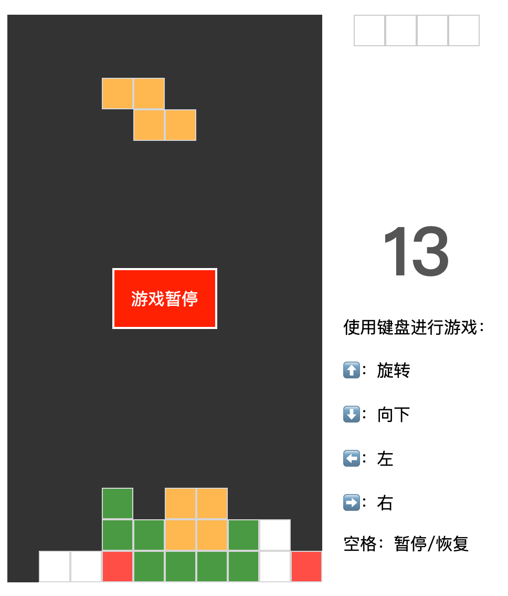

# TpyeScript 实现俄罗斯方块小游戏

设计思路：单一原则、开闭原则。

数据逻辑模块和页面展示模块分离。



```
./src
├── core
│   ├── Game.ts             // 游戏控制
│   ├── GameConfig.ts       // 游戏配置
│   ├── Square.ts           // 小方块类
│   ├── SquareGroup.ts      // 方块组合 
│   ├── Teris.ts            // 继承方块组合
│   ├── TerisRules.ts       // 移动规则
│   ├── types.ts    
│   ├── utils.ts
│   └── viewer              // 显示相关
│       ├── GamePageViewer.ts
│       ├── PageConfig.ts   // 显示页面配置
│       └── SquarePageViewer.ts
└── index.ts
```